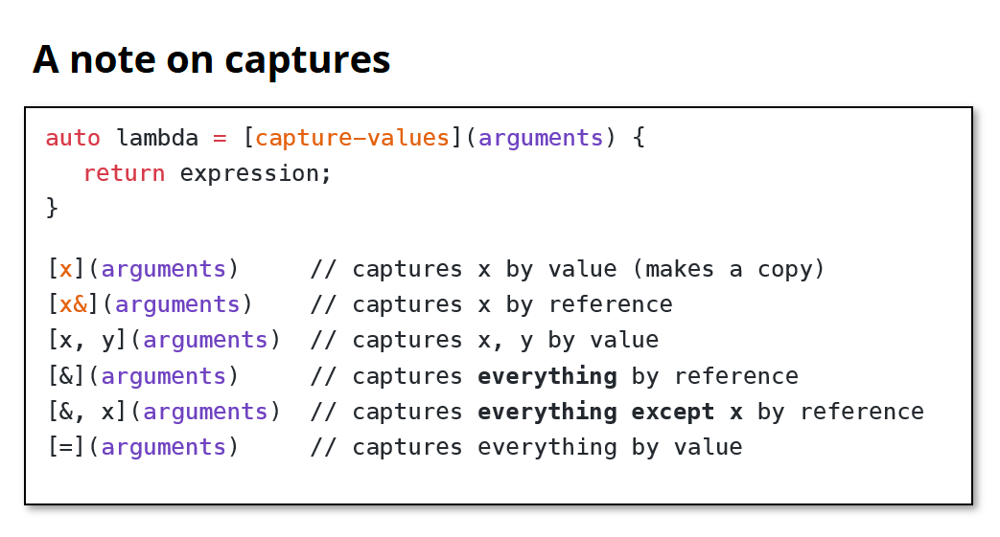
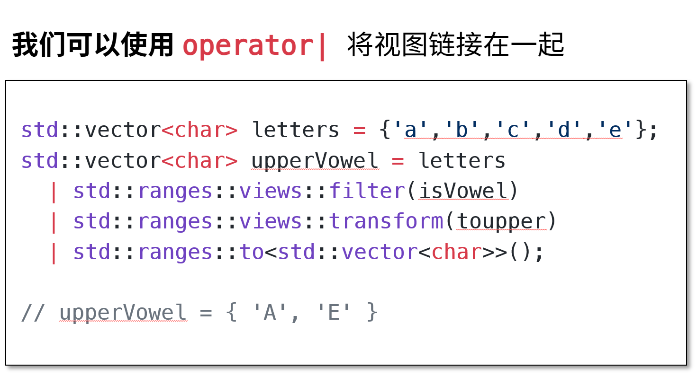

# Template Functions
## min函数
```c++
// 这是一个简单的函数，用于返回两个值中较小的那个。
// 注意它通过值传递参数，并假设两个参数是相同的类型。
template <typename T>
T min_basic(T a, T b) {
  return a < b ? a : b;
}
// 显式实例化
int int_min = min_basic<int>(106, 107);
// 隐式实例化
int int_min = min_ref(106, 107);
// 这是一个更灵活的 min 函数，
// 即使 a 和 b 类型不同，只要可以相互转换也可以使用。
// 使用 auto 返回类型，编译器会推导返回类型。
template <typename U, typename V>
auto min_flex(const U& a, const V& b) {
  return a < b ? a : b;
}
```
## conpects
conceps 用于限制模板参数类型
在默认情况下，typename T 允许任何类型，但是在实例化之后可能会报错，也就是说这两个是不可以进行比较的

```c++
template <typename T>
concept Comparable = requires(T a, T b) {
  // 为了让 T 满足 Comparable，a < b 必须在编译时有效，
  // 且结果类型可以转换为 bool。
  { a < b } -> std::convertible_to<bool>;
};

// 使用 Comparable 限制 min 函数的类型
template <Comparable T>
T min_constrained(const T& a, const T& b) {
  return a < b ? a : b;
}

void test_min_constrained() {
  // 可行：int 支持 < 运算符
  min_constrained(10, 20);

  // 不可行：std::stringstream 没有定义 <
  // 取消下面的注释尝试编译会失败
  min_constrained(std::stringstream(), std::stringstream());
}
```

## 可变参数模板：构建可变参数 min 函数

```c++
// 可变参数模板支持任意数量的参数，
// 它通过递归在实例化时生成重载函数。

// 基础情况：一个参数时，min 就是它本身
template <Comparable T>
T min_var(const T& v) { return v; }

// 递归情况：min(v, ...rest) = v < min(rest...) ? v : min(rest...)
template <Comparable T, Comparable... Args>
T min_var(const T& v, const Args&... rest) {
  auto m = min_var<T>(rest...); 
  return v < m ? v : m;
}
// 这里就是要从一连串的数字中找出最小的那一个

// 参数类型可以不同，但返回值类型由第一个参数决定
std::string expr4 { "min_var(10, 2.5, 3.0f): " };
auto m4 = min_var(10, 2.5, 3.0f);
out() << expr4 << result << m4 << end;
out() << "类型为 " + expr4 << result << type(m4) << end;

// 使用显式模板指定返回类型，得到正确类型
std::string expr5 { "min_var<double>(10, 2.5, 3.0f): " };
auto m5 = min_var<double>(10, 2.5, 3.0f);
out() << expr5 << result << m5 << end;
out() << "类型为 " + expr5 << result << type(m5) << end;
```
参数的类型不必全部相同
### TMP Template Metaprogramming 模板元编程

constexpr 强制编译时求值 编译时计算：提高性能，确定变量的常量性，增强类型安全

# Functions and Lambdes

## Lambda Synax

```c++
int n;
sid::cin >> n;
// [n] 捕获子句 让我可以使用函数外部的变量
auto lessThanN = [n] (int x) {
  return x < n;
}
```


## Functor
重载了 operator() 的类的对象，可以像函数一样被调用
因为他是一个对象，他还可以拥有状态

```c++
#include <iostream>
using namespace std;

struct Adder {
  int operator()(int a, int b) {
    return a + b;
  }
  // int value = 0;
};

int main () {
  Adder add;
  cout << add(3, 4);
  return 0;
}

// output: 7
```

## 懒惰计算
不会提前计算 按需取值（更高效）
### 常见的views举例
| 名称                        | 作用                      |
| ------------------------- | ----------------------- |
| `views::filter`           | 过滤满足条件的元素               |
| `views::transform`        | 映射（map），对每个元素应用函数       |
| `views::take(n)`          | 取前 `n` 个元素              |
| `views::drop(n)`          | 跳过前 `n` 个元素             |
| `views::iota(start, end)` | 生成一个整数序列 `[start, end)` |
| `views::reverse`          | 倒序视图（不修改原容器）            |


### |

有一点像 Linux 中的 pipe